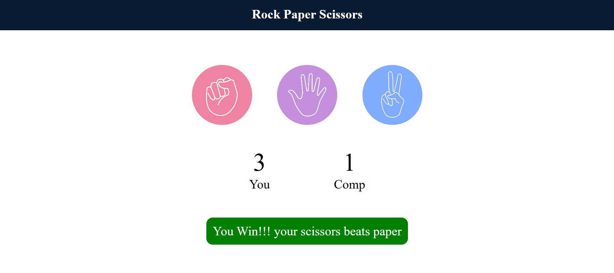

# Rock Paper Scissors Game 🎮

A simple and interactive **Rock Paper Scissors** game built using **HTML, CSS, and JavaScript**. The player competes against the computer, and the game dynamically updates the score and displays the result after each round.

---

## ✨ Features
- 🎨 **Responsive UI** with attractive buttons for Rock, Paper, and Scissors.
- 🤖 **Computer-generated moves** for fair gameplay.
- 📊 **Real-time score updates** for Player and Computer.
- ✅ **Dynamic result display** showing Win, Lose, or Draw.

---

## 🛠️ Technologies Used
- **HTML5** – Structure of the game
- **CSS3** – Styling and layout
- **JavaScript (ES6)** – Game logic and interactivity

---

## 📸 Screenshot

---

## 🚀 How to Play
1. Select **Rock**, **Paper**, or **Scissors** by clicking the respective icon.
2. The computer will randomly select its choice.
3. The result (Win, Lose, or Draw) will be displayed with updated scores.
4. Play as many rounds as you want!

---
